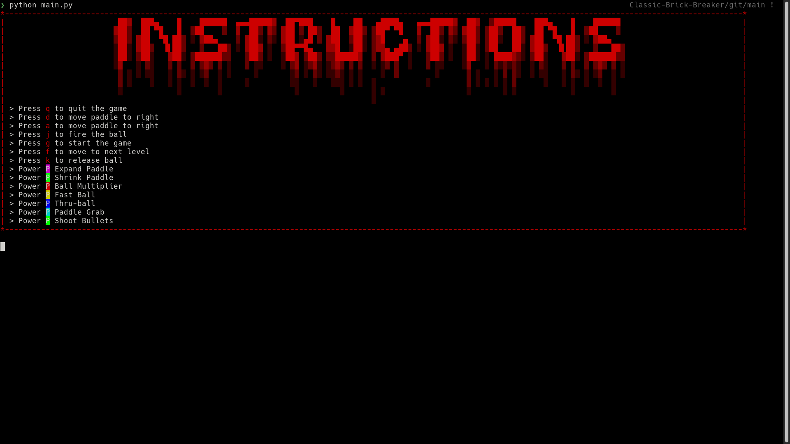
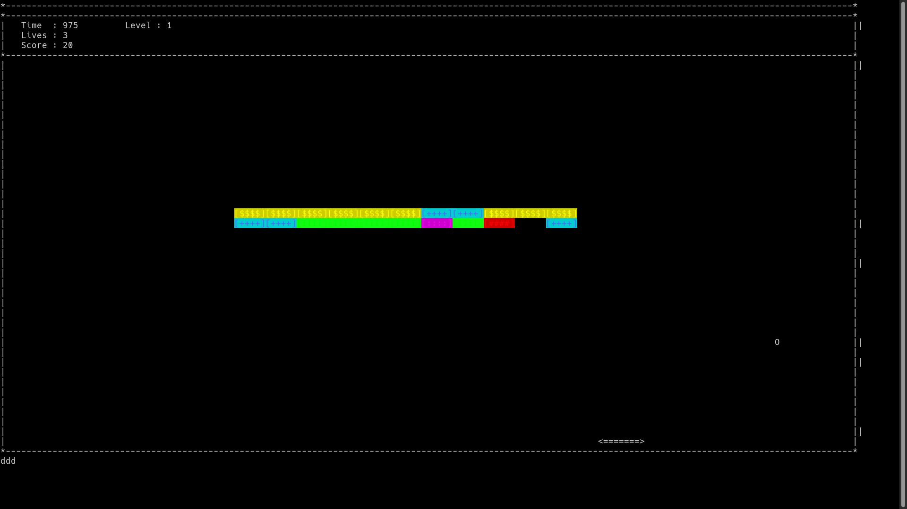
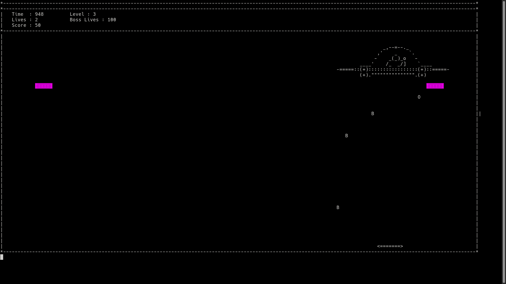

# Classic Brick Breaker Game

## Requirements :
-   Python3

-   Python3 packages :
      1)   sys
      2)   termios
      3)   tty
      4)   signal
      5)   numpy
    
-   Runing on Linux distributions :
      +   sudo apt update
      +   sudo apt-get python3
      +   cd <folder_containing_the_game_files>
      +   python3 main.py

## Controls :
-  `g` : start the game
-  `d` : move paddle to right
-  `a` : move paddle to left
-  `k` : release ball
-  `j` : fire the ball
-  `q` : quit the game

## Cheats :innocent: :
-  `f` : to move to next level

## File Content :
-  [art.py](art.py) :
   -  Contains Important Ascii arts, which are used int the programme.
-  [ball.py](ball.py) :
   -  Handles functionality of Ball like collision-detection, speed-control etc.
-  [bricks.py](bricks.py) : 
   -  Contains code to render, delete & update bricks.
-  [gametop.py](gametop.py) : 
   -  Updates top values like Score, Time etc.
-  [headerfile.py](headerfile.py) :
   -  It contains some important attributes, constants & definations which are used in the Game.
-  [inherit_brick.py](inherit_brick.py) :
   -  Defines different types of bricks to render on the screen.
-  [items.py](items.py) :
   -  Contains some important items like instructions etc.
-  [keypressed.py](keypressed.py) : 
   -  Containing functionality to take input from the User.
-  [main.py](main.py) :
   -  Calls the game.
-  [mainrunning.py](mainrunning.py) :
   -  Contains main game flow logic.
-  [paddle.py](paddle.py) :
   -  Handles paddle functionality.
-  [powerup.py](powerup.py) :
   -  Contains classes & function for Powerup using function overiding method
-  [screen.py](screen.py) :
   -  Contains code for creating, writing, clearing the screen.

## Screenshots :
   
> **Start Menu**

> **Level 1**

> **Boss Level**

